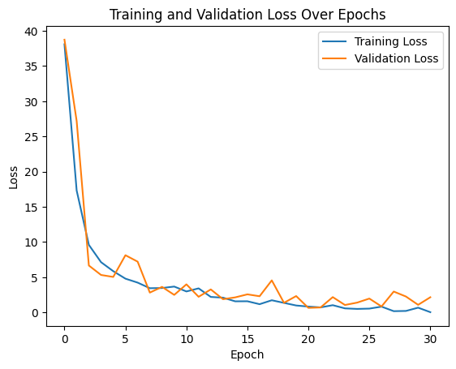

## ResNet with Convolutional Block Attention Module for Absolute Pose Regression

### The inituition and implementation of ResNet with CBAM are from the papers [CBAM: Convolutional Block Attention Module](https://arxiv.org/abs/1807.06521) and [ASA for Multi-Scene APR: Activating Self-Attention for Multi-Scene Absolute Pose Regression](https://arxiv.org/abs/2411.01443)

### Combining Pose Regression and pose loss module from ASA for Multi-Scene APR and convolutional bloack attention, and channel, spatial module to achieve great training and validation loss.

### We ran the code on T4-GPU from Google colab.